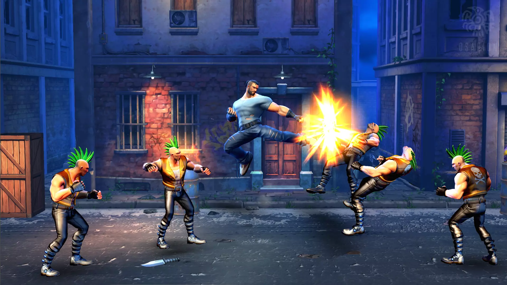

# Unity3D-Beat-enUp-Game

## 프로젝트 개요

이 프로젝트는 격투 게임의 타격감과 최적화를 중점으로 개발되었습니다. 플레이어가 전투에 몰입할 수 있도록 타격감을 극대화하고, 최적화를 통해 원활한 플레이를 제공하는 방법을 고민하며 다양한 기능을 구현했습니다. 콤보 공격, 캐릭터 이동과 점프, 로딩 화면, 인벤토리, 캐릭터 선택, 상점, 스테이지 클리어 기능 등을 포함하여 깊이 있는 게임 경험을 제공합니다.

**프로젝트 기간**: 2021년 4월 - 2022년 6월  
**플랫폼**: PC
**엔진**: Unity  
**도구**: Git, C#

[게임 플레이 영상](https://www.youtube.com/watch?v=-DZdnJOjs60)

## 

---

## 구현 상세

### 1. 콤보 공격 시스템

## 

- **콤보 및 스킬 공격**: 특정 키를 연속 입력하면 콤보 공격이 발동되도록 구현했습니다. 입력된 키는 Queue로 저장하여 특정 패턴이 입력되었을 때 강력한 특수 공격이 발동될 수 있습니다.
- **기 모으기 공격**: 특정 키를 계속 누르면 캐릭터가 기를 모으고, 기를 모은 시간에 비례해 공격력이 증가하도록 설정했습니다. 이를 통해 플레이어가 공격 강도를 전략적으로 조절할 수 있습니다.
- **타격 판정 시스템**: 주먹과 발에 각각 공격 판정 컴포넌트를 부여하여, 적에게 실제로 닿을 때만 타격 효과가 발생하도록 설정했습니다. 이를 통해 타격감이 더욱 현실감 있게 구현되었습니다.

### 2. 캐릭터 이동 및 점프 구현

- **중력 기반 점프**: 캐릭터의 중력값을 계산하여, 일정한 높이와 속도로 점프할 수 있도록 구현했습니다. 이를 통해 캐릭터가 자연스럽고 일관된 물리적 움직임을 보입니다.
- **애니메이션 블렌드 트리**: 스프린트와 걷기 애니메이션을 블렌드 트리로 구현하여 캐릭터의 이동 속도에 맞춰 자연스럽게 애니메이션이 전환되도록 했습니다. 이를 통해 플레이어가 캐릭터의 움직임을 보다 부드럽게 경험할 수 있습니다.

### 3. 인벤토리 시스템

- **아이템 장착 및 해제**: 인벤토리를 통해 다양한 아이템을 장착하거나 해제하여 캐릭터의 공격력과 방어력을 강화할 수 있도록 구현했습니다. 장비된 아이템에 따라 캐릭터의 능력치가 실시간으로 변동되어 플레이어가 전략적으로 캐릭터를 강화할 수 있습니다.

### 4. 캐릭터 선택 기능

- **다양한 캐릭터 선택**: 게임 시작 시 플레이어가 여러 캐릭터 중 하나를 선택할 수 있으며, 선택된 캐릭터의 특성과 능력치에 따라 다른 플레이 스타일을 경험할 수 있도록 구현했습니다. 이를 통해 다양한 캐릭터의 특성을 활용한 전략적인 게임플레이가 가능합니다.

### 5. 상점 시스템

- **아이템 구매 및 판매**: 상점을 통해 아이템을 구매하거나 판매할 수 있도록 구현하여, 플레이어가 전투에 필요한 장비와 아이템을 획득할 수 있도록 했습니다. 상점에서의 거래는 자원의 전략적 활용을 요구하며, 게임 진행에 도움을 줍니다.

### 6. 스테이지 클리어 및 진행

- **스테이지 기반 진행**: 스테이지 클리어 시스템을 통해 플레이어가 각 스테이지를 클리어할 때마다 다음 스테이지로 진입할 수 있도록 했습니다. 스테이지가 진행됨에 따라 난이도가 점진적으로 상승하며, 다양한 적과 보스를 상대할 수 있는 구조를 구현했습니다.

### 7. 로딩 화면 구현

- **비동기 씬 로드**: 각 씬 전환 시 로딩 화면을 구현하여, 오브젝트 배치가 많은 씬에서도 자연스러운 전환이 이루어지도록 했습니다. Unity의 비동기 씬 로드 기능을 활용하여, 로딩 중에도 플레이어가 불편함 없이 게임을 즐길 수 있도록 최적화했습니다.
